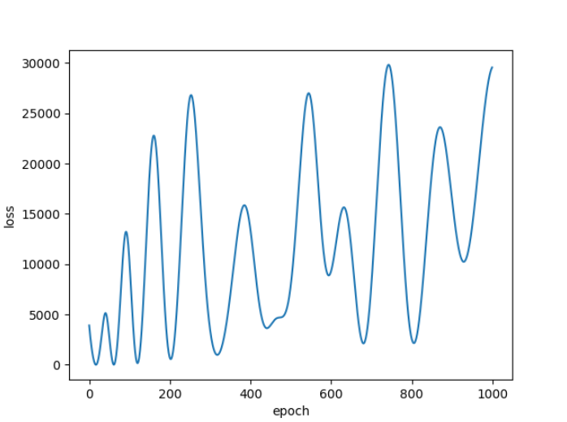
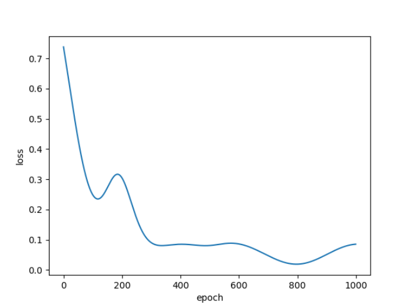
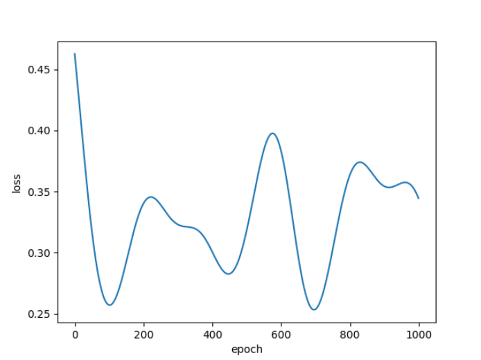

# 奇偶数预测分析

训练集：从0-999中随机采样10000个整数样本 

测试集：从0-999中随机采样500个整数样本

每种方法均训练1000个epoch，各方案loss变化、预测准确率与分析如下：

方案1：预测准确率为54.8%；loss呈振荡发散，说明模型不断尝试寻找局部最优点，但是最终的结果是模型未能学习到有效的特征，准确率接近于盲猜。

方案2：预测准确率为99.2%；loss逐步收敛，说明二进制对于该问题是一种有效的表征方式。从理论上来讲，模型只需要关注输入的最后一位是0还是1即可确定是偶数还是奇数，因此神经网络模型很容易学习到对应部分神经元的参数。

方案3：预测准确率为100.0%；loss第一次收敛到局部最优点非常快，尤其是将训练epoch设置为100时，方案2的准确率为70.4%，而方案3达到100.0%；有图中可知，本方案模型训练过程中多次收敛到局部最优点，从整体上看，随着训练轮数的增加，不断接近全局最优点。不同于线性激活函数，三角函数的使用引入了周期性，提升了模型的拟合能力。

