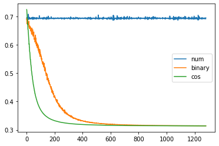
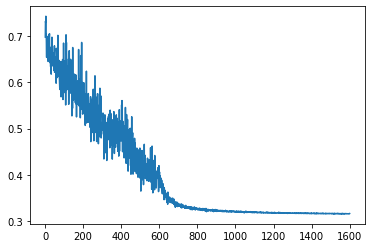

# 预测奇偶数
训练集：0~1000的整数；
测试集：从训练集中随机抽取500个数字进行评估。

## 训练结果
| 编码方式 | 是否收敛 | 准确度 |
| :---: | :---: | :---: |
| 纯数字 | 否 | 0.51 |
| 十位数的二进制编码 | 是 | 1.00 |
| 余弦函数 | 是 | 1.00 |

## 训练图示

## 小结
三种编码方式中，二进制和余弦函数编码能够收敛。
余弦函数收敛更快，模型输入维数也更低，因此在实践中更为好用。

## 为什么纯数字编码不行？
个人觉得是纯数字的编码在反应奇偶特征上很乏力，
我们知道，对于预测奇偶来说，0~50的数字跟900~950的数字并没有什么区别，
但神经网络会认为这两组数据相差甚远。

如果我们做一个“取余10”的操作，把数字的范围缩小，模型是能收敛的，如下图：

