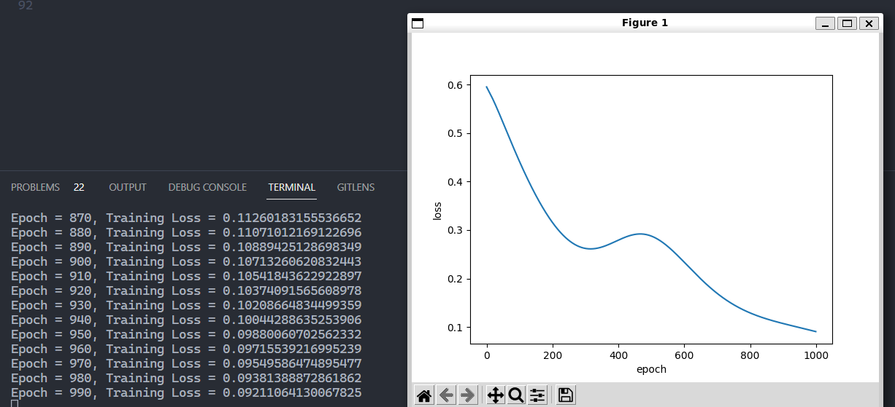

# 奇偶数预测

训练集包括0-999这些数字中sample出来的10000个数字，测试集为100个数字。每个方法的核心逻辑差不多，均训练1000个epoch

记录各方案的loss训练曲线、预测准确率与相应分析如下：

方案1：loss发散，预测准确率为47%。虽然如果换换seed，看起来是趋于收敛的方向，但其实严重的过拟合于训练集，什么都没学出来。

方案2，loss收敛，预测准确率为99%。在本问题中，二进制是一个非常好用的表征方式，因为我们其实只需要关注最后一位是0还是1即可，因此MLP最后会学到对这一部分神经元的激活，而屏蔽其它神经元的影响，从而得到一个准确的分类器。

方案3，loss收敛，且比方案二收敛的更快，预测准确率为99%，loss收敛。不同于MLP常用的relu、sigmoid，本问题还可以使用三角函数作为激活函数，直接学习函数$y=\frac{1}{2}\cos(\pi x)+\frac{1}{2}$的对应weight和bias，从而将整个分类问题转变为直接输出数值的回归问题。

从实验结果看，效果虽然和方案2一样，但收敛速度、模型参数大大优于方案2（方案3其实500epoch以内即可收敛），这是因为本问题对人类来说非常简单，因为我们观察到了问题可以用三角函数刻画一种周期性（周期为2），因此可以直接写出上述解析式，那激活函数显然就可直接用cos。纳入这样强力的人为先验知识，相比让MLP学到屏蔽其它二进制位数，直接让问题一下子异常好学。

