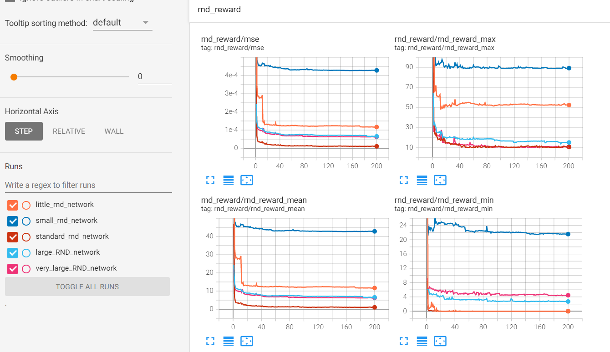

# 奖励模型的训练实践

运行不同的超参数配置后结果如下图所示：

可以看到，RND需要拟合的target网络参数大小无比重要，网络结构是一个重要超参。当参数过少的时候，模型拟合能力差，出现欠拟合，从而MSE下降极其缓慢；当参数过多的时候，模型拟合能力过强，在rnd reward上与最优超参相当，但因为容易过拟合于某一个训练batch，从而在测试data上预测效果不佳，基于MSE的整体学习速度缓慢。

